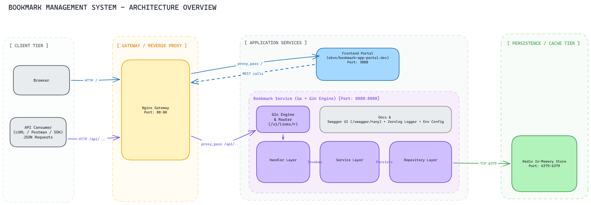

# Bookmark Deployment

Multi-container deployment stack for the Bookmark management platform, powered by Docker Compose and Nginx Reverse Proxy.

## Architecture & Documentation




## Quick Start

```bash
# Start all containers in detached mode
docker compose up -d

# Check running services
docker compose ps

# View logs
docker compose logs -f
```

## Service Endpoints

| Service | Endpoint | Owner / Config |
|---|---|---|
| **Frontend Portal** | `http://localhost/` | [ebvn/bookmark-app-portal:dev](docker-compose.yml#L17) |
| **Backend API Health** | `http://localhost/api/bookmark_service/health-check` | [bookmark_service](docker-compose.yml#L8) |
| **Swagger UI** | `http://localhost/api/bookmark_service/swagger/index.html` | [docs/](file:///home/ubuntu/Workspaces/bookmark-management/docs) |
| **Redis** | `localhost:6379` | [redis:alpine](docker-compose.yml#L2) |

Configuration is stored in [bookmark_service/.env](bookmark_service/.env) and [nginx/nginx.conf](nginx/nginx.conf).