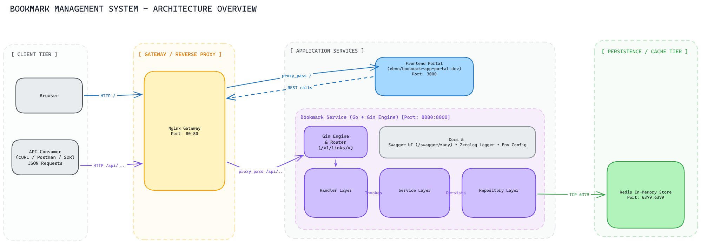
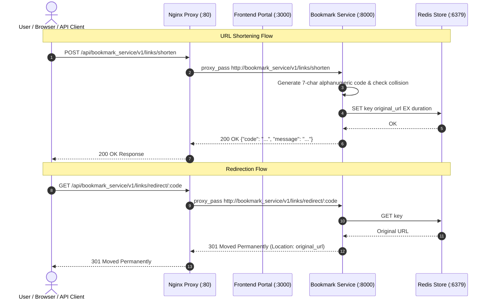

# Bookmark System Architecture

This document describes the high-level architecture, service components, and operational flow of the Bookmark system.

---

## 1. System Overview

The system provides a URL bookmarking and shortening platform composed of four core containerized services orchestrated via Docker Compose:

1. **Reverse Proxy / API Gateway**: [Nginx](file:///home/ubuntu/Workspaces/bookmark-deployment/nginx/nginx.conf) on port `80`.
2. **Frontend Web Portal**: [Portal](https://github.com/ebvn/bookmark-app-portal) (SolidStart) on internal port `3000`.
3. **Core Backend Service**: [`bookmark_service`](file:///home/ubuntu/Workspaces/bookmark-management) (Go / Gin) on internal port `8000` (host port `8080`).
4. **Data Persistence & Caching**: [Redis](file:///home/ubuntu/Workspaces/bookmark-deployment/docker-compose.yml#L2-L6) on port `6379`.

---

## 2. Visual Architecture

### 2.1 Topology & Layered Architecture Diagram



> Sơ đồ gốc có thể chỉnh sửa tại [architecture.excalidraw](architecture.excalidraw) (hỗ trợ Excalidraw, VS Code extension hoặc [excalidraw.com](https://excalidraw.com)).

### 2.2 Traffic & Data Flow



---

## 3. Component Breakdown & Executable Owners

### 3.1 Gateway / Reverse Proxy (`nginx`)
- **Owner**: [`nginx/nginx.conf`](file:///home/ubuntu/Workspaces/bookmark-deployment/nginx/nginx.conf)
- **Role**: Single entry point for external HTTP traffic.
- **Routing Rules**:
  - `location /` ➔ Upstream `portal:3000` (Web UI).
  - `location /api/bookmark_service/` ➔ Upstream `bookmark_service:8000/` (REST API).

### 3.2 Frontend Portal (`portal`)
- **Image**: `ebvn/bookmark-app-portal:dev`
- **Internal Port**: `3000`
- **Framework**: SolidStart (SolidJS SSR/CSR).
- **Role**: User-facing interface for bookmark creation, short link generation, and navigation.

### 3.3 Backend API Service (`bookmark_service`)
- **Repository**: [`bookmark-management`](file:///home/ubuntu/Workspaces/bookmark-management)
- **Image**: `chillseanguyen/lecture_4` (Port `8080:8000`)
- **Runtime & Framework**: Go 1.22+ with Gin.
- **Layered Structure**:
  - **Router & Config**: [`internal/api/api.go`](file:///home/ubuntu/Workspaces/bookmark-management/internal/api/api.go), [`internal/api/config.go`](file:///home/ubuntu/Workspaces/bookmark-management/internal/api/config.go).
  - **Handler**: [`internal/app/handler/shorten_url.go`](file:///home/ubuntu/Workspaces/bookmark-management/internal/app/handler/shorten_url.go), [`internal/app/handler/health_check.go`](file:///home/ubuntu/Workspaces/bookmark-management/internal/app/handler/health_check.go).
  - **Service**: [`internal/app/service/shorten_url.go`](file:///home/ubuntu/Workspaces/bookmark-management/internal/app/service/shorten_url.go) (7-character random key generation with retry on collision).
  - **Repository**: [`internal/app/repository/url_storage.go`](file:///home/ubuntu/Workspaces/bookmark-management/internal/app/repository/url_storage.go) (Redis persistence adapter).
  - **API Documentation**: Auto-generated Swagger at `/swagger/index.html` via `swaggo/swag` ([`docs/`](file:///home/ubuntu/Workspaces/bookmark-management/docs)).

### 3.4 Storage & Cache (`redis`)
- **Image**: `redis:alpine`
- **Port**: `6379:6379`
- **Data Model**:
  - `Key`: Short code (e.g. `aB3xK9z`, 7 characters).
  - `Value`: Original URL (string).
  - `Expiration (TTL)`: In seconds, passed by client in shortening request (maximum 604,800s / 7 days).
- **Access Complexity**: O(1) in-memory read/write.

---

## 4. Environment & Operations

### 4.1 Configuration
Configuration values for the backend service are defined in [`bookmark_service/.env`](file:///home/ubuntu/Workspaces/bookmark-deployment/bookmark_service/.env):
- `REDIS_ADDRESS`: Host and port for Redis (default: `redis:6379`).
- `API_APP_HOSTNAME`: Hostname reported in Swagger documentation.

### 4.2 Operating Commands
The stack is managed via Docker Compose from the repository root:

```bash
# Start all services in background
docker compose up -d

# Check service logs
docker compose logs -f

# Check health check endpoint
curl -s http://localhost/api/bookmark_service/health-check

# Stop stack
docker compose down
```

### 4.3 Key Verification Endpoints
- Web Portal: `http://localhost/`
- Service Health Check: `http://localhost/api/bookmark_service/health-check`
- Swagger Documentation: `http://localhost/api/bookmark_service/swagger/index.html`
